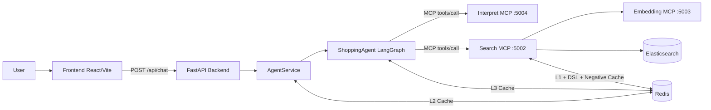

# Shopping AI Assistant V3

Persian shopping assistant built with FastAPI, LangGraph, MCP servers, Redis caching, and Elasticsearch.

## What This Project Does
- Conversational Persian shopping assistant
- Decides between normal chat, clarification, and product search
- Uses tool-calling (`search_and_deliver`, `get_product_details`) for product results
- Returns structured API responses for frontend rendering
- Emits pipeline latency summaries for bottleneck analysis

## High-Level Architecture


## Active Services
- `frontend` -> `${FRONTEND_HOST_PORT:-3000}`
- `backend` (FastAPI) -> `${BACKEND_HOST_PORT:-8080}`
- `interpret` (MCP) -> `${MCP_INTERPRET_HOST_PORT:-5004}`
- `search` (MCP) -> `${MCP_SEARCH_HOST_PORT:-5002}`
- `embedding` (MCP) -> `${MCP_EMBEDDING_HOST_PORT:-5003}`
- `redis` -> `${REDIS_HOST_PORT:-6379}`

## Core Runtime Flow
1. Frontend calls `POST /api/chat`.
2. Backend `AgentService` checks L2 agent cache.
3. On miss, `ShoppingAgent` runs ReAct and decides tool usage.
4. For product search, agent calls `search_and_deliver` tool:
   - interpret (`direct | unclear`)
   - search (+ rerank)
   - format results JSON block
5. `AgentService` extracts products, cleans response text, returns structured API payload.
6. Cache layers are updated when applicable.

## Caching Layers
- **L1 Search Cache** (search server): query/result cache + negative cache + DSL cache
- **L2 Agent Cache** (`AgentService`): full API response cache for repeated direct queries
- **L3 LLM Response Cache** (`src/agent.py`): cached final formatted LLM text keyed by search params

## Quick Start (Local)
```bash
cp .env.example .env
python3 -m pip install -r requirements.txt
python3 -m src.mcp_servers.run_servers
python3 -m uvicorn backend.main:app --host 0.0.0.0 --port 8080 --reload
```

## Quick Start (Docker)
```bash
docker compose up --build
```

Debug stack:
```bash
docker compose -f docker-compose.yml -f docker-compose.dev.yml up --build
```

## Configuration Highlights
- Agent model routing:
  - `AGENT_MODEL_PROVIDER=openrouter|groq`
  - `AGENT_MODEL=...`
- Interpret/Search model (GitHub/OpenRouter override through env)
- Redis/Elasticsearch endpoints
- Pipeline logging controls:
  - `DEBUG_LOG`
  - `PIPELINE_LOG_TO_FILE`
  - `PIPELINE_LOG_MAX_BYTES`
  - `PIPELINE_LOG_BACKUP_COUNT`

See full config details in:
- `docs/en/OPERATIONS.md`
- `docs/fa/OPERATIONS.md`

## Observability and Latency Analysis
Pipeline logs are written under `logs/`:
- `pipeline-shopping-assistant-backend.log`
- `pipeline-shopping-assistant-interpret.log`
- `pipeline-shopping-assistant-search.log`
- `pipeline-shopping-assistant-embedding.log`

Useful commands:
```bash
grep -h "LATENCY_SUMMARY" logs/pipeline-*.log
python3 scripts/analyze_latency_logs.py --log-dir logs --top 30
python3 scripts/analyze_latency_logs.py --log-dir logs --component agent.chat
python3 scripts/analyze_latency_logs.py --log-dir logs --component interpret.pipeline
python3 scripts/analyze_latency_logs.py --log-dir logs --component search.pipeline
```

## Testing
```bash
pytest -q
```

Targeted quick checks:
```bash
pytest -q tests/test_agent_service.py tests/test_agent_cache.py tests/test_pipeline_logger.py
```

## Rollback
If a deployment causes issues:
```bash
git revert <commit_sha>
```

For cleanup snapshots restored by script:
```bash
bash scripts/restore_cleanup_backup.sh
```

## Documentation Map
- Index: `docs/README.md`
- English:
  - `docs/en/ARCHITECTURE.md`
  - `docs/en/PIPELINES.md`
  - `docs/en/API.md`
  - `docs/en/OPERATIONS.md`
- فارسی:
  - `docs/fa/ARCHITECTURE.md`
  - `docs/fa/PIPELINES.md`
  - `docs/fa/API.md`
  - `docs/fa/OPERATIONS.md`
