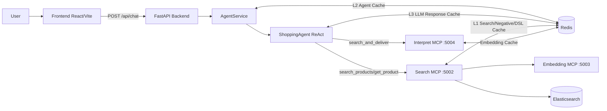

# Shopping AI Assistant V3

Persian shopping assistant with an agent-first architecture:
- FastAPI backend as API gateway
- LangGraph ReAct agent for tool decision
- MCP microservices for interpret/search/embedding
- Redis multi-layer caching
- Elasticsearch product retrieval

This README is the fast entry point. For full technical details, use `docs/README.md`.

## Architecture Snapshot


## Runtime Components
- `backend/`: HTTP API (`/api/chat`, `/api/health`)
- `src/agent.py`: prompt-driven routing + tool calling
- `src/mcp_client.py`: JSON-RPC MCP client with session/retry handling
- `src/mcp_servers/interpret_server.py`: `direct|unclear` classification + extraction
- `src/mcp_servers/search_server.py`: DSL generation + ES search + rerank + cache
- `src/mcp_servers/embedding_server.py`: embedding/similarity service
- `src/pipeline_logger.py`: traceable structured latency logs

## Core Request Paths
1. **Chat/clarify path**
- User message goes to agent.
- Agent responds directly (no search tool), or asks clarification.

2. **Direct product search path**
- Agent calls `search_and_deliver(query)`.
- Tool calls interpret (`interpret_query`) -> if `direct`, calls search (`search_products`).
- Search returns ranked products; agent returns final answer.
- `AgentService` extracts structured products and returns API payload.

3. **No-result path**
- Search returns zero hits.
- Tool returns clarification suggestions instead of raw failure.

## Cache Layers
- `L1` Search Cache (`search_server` Redis): search result cache + negative cache + DSL cache
- `L2` Agent Response Cache (`AgentService` Redis): full response cache for repeated direct queries
- `L3` LLM Response Cache (`src/agent.py` Redis): cached final formatted answer keyed by search params
- Interpret embedding cache (`interpret_server` Redis): cached query embeddings used in category matching
- Embedding service cache (`embedding_server` in-process): short-term embedding cache inside embedding service

## Quick Start (Docker)
```bash
cp .env.example .env
docker compose up --build
```

## Quick Start (Local processes)
```bash
cp .env.example .env
python3 -m pip install -r requirements.txt
python3 -m src.mcp_servers.run_servers
python3 -m uvicorn backend.main:app --host 0.0.0.0 --port 8080 --reload
```

## Logs and Latency Analysis
Pipeline logs are in `logs/` and include compact `LATENCY_SUMMARY` events.

```bash
grep -h "LATENCY_SUMMARY" logs/pipeline-*.log
python3 scripts/analyze_latency_logs.py --log-dir logs --top 30
python3 scripts/analyze_latency_logs.py --log-dir logs --component agent.chat
python3 scripts/analyze_latency_logs.py --log-dir logs --component interpret.pipeline
python3 scripts/analyze_latency_logs.py --log-dir logs --component search.pipeline
```

## Service Ports (Default)
- Frontend: `3000`
- Backend: `8080` (or `8081` depending on `.env`)
- Interpret MCP: `5004`
- Search MCP: `5002`
- Embedding MCP: `5003`
- Redis host binding: `REDIS_HOST_PORT` (recommended `6380` in `.env.example`)

## Testing
```bash
pytest -q
```

Focused regression checks:
```bash
pytest -q tests/test_agent_service.py tests/test_agent_cache.py tests/test_mcp_client.py tests/test_pipeline_logger.py
```

## Documentation Map
- Index: `docs/README.md`
- English:
  - `docs/en/ARCHITECTURE.md`
  - `docs/en/PIPELINES.md`
  - `docs/en/API.md`
  - `docs/en/OPERATIONS.md`
- فارسی:
  - `docs/fa/ARCHITECTURE.md`
  - `docs/fa/PIPELINES.md`
  - `docs/fa/API.md`
  - `docs/fa/OPERATIONS.md`
