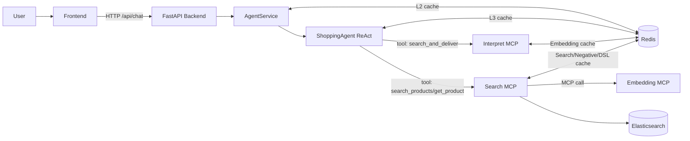
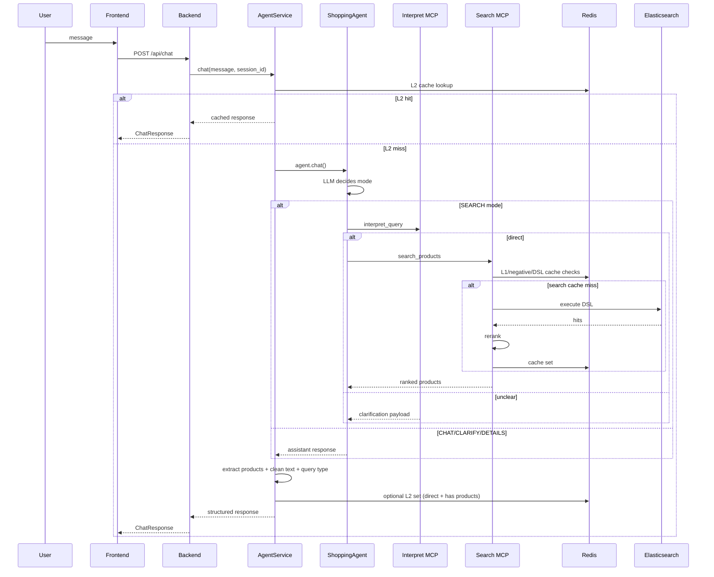
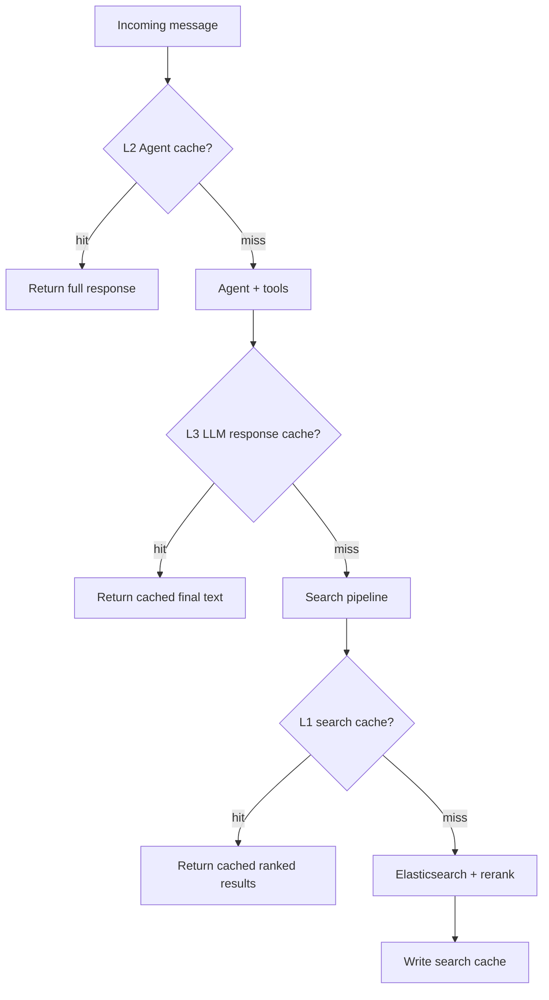

# Architecture (English)

## 1. Scope and Architectural Style
Shopping AI Assistant V3 is an **agent-first, tool-augmented architecture**.

Key properties:
- Single API gateway (`FastAPI`) for frontend integration.
- LLM agent (`LangGraph ReAct`) owns turn-level decision making.
- Tool execution is delegated to MCP services over JSON-RPC (`/mcp`).
- Retrieval system is cache-heavy and Elasticsearch-backed.
- Pipeline is instrumented with structured latency logs.

## 2. Topology

## 3. Component Responsibilities

| Component | Main Files | Responsibility |
|---|---|---|
| API Gateway | `backend/main.py`, `backend/api/routes.py` | HTTP contracts, lifecycle, health checks, CORS |
| Service Layer | `backend/services/agent_service.py` | Agent init, timeout boundary, L2 cache, response normalization |
| Agent | `src/agent.py` | Prompted routing decisions, tool calling, memory, L3 cache |
| MCP Client | `src/mcp_client.py` | Session initialize/retry, JSON/SSE parse, tool dispatch |
| Interpret Service | `src/mcp_servers/interpret_server.py` | `direct/unclear` classification + search param extraction |
| Search Service | `src/mcp_servers/search_server.py` | DSL generation, ES query, rerank, category guards, search caches |
| Embedding Service | `src/mcp_servers/embedding_server.py` | Embedding generation/similarity with in-process cache |
| Telemetry | `src/pipeline_logger.py` | trace context, per-stage logs, `LATENCY_SUMMARY` |

## 4. End-to-End Control Flow

## 5. Agent Decision Model
`ShoppingAgent` is prompt-driven and uses two tools:
- `search_and_deliver(query)` (return-direct)
- `get_product_details(product_id)`

Prompt decision modes:
- `CHAT`
- `CLARIFY`
- `SEARCH`
- `DETAILS`

Actual interpret output contract is stricter:
- `direct`
- `unclear`

Implication:
- Agent may choose `SEARCH`, but interpret can still downgrade to `unclear`, which returns clarification to the user.

## 6. Cache Architecture

Cache namespaces currently used:
- `cache:v1:agent:*` (L2)
- `cache:v1:llm_response:*` (L3)
- `cache:v2:search:*` (L1)
- `cache:v2:negative:*` (negative cache)
- `cache:v1:dsl:*` (DSL cache)
- `cache:v1:embedding:*` (interpret embedding cache)

## 7. Search Quality Controls
Implemented in `src/mcp_servers/search_server.py`:
- category normalization against known category list
- DSL category filter pruning if category is not allowed
- one-step relaxed retry (remove categories) when zero hits
- relevancy-aware rerank on top of ES score + price + brand + discount

## 8. Session and Memory Semantics
- Conversation memory is managed by LangGraph `MemorySaver`.
- `session_id` from API is mapped to `thread_id` in agent invocation.
- If tool-message history corruption is detected, agent retries with a new session.

## 9. Reliability and Fallbacks
- MCP client handles init retries and session reset on 404/session expiry.
- Agent can fall back from OpenRouter to Groq when tool-use endpoint is unavailable.
- Backend shields raw failures and returns safe structured responses (`success=false`) with `error_stage/error_type` in metadata.

## 10. Observability Model
`src/pipeline_logger.py` emits structured logs with trace IDs.

Critical emitted components:
- `agent_service.chat`
- `agent.chat`
- `agent.tool.search_and_deliver`
- `mcp_client.initialize`
- `mcp_client.call_tool`
- `interpret.pipeline`
- `search.pipeline`

These are designed for `scripts/analyze_latency_logs.py`.

## 11. Known Architectural Constraints (Current Code)
- Agent output still passes through LLM after tool response; final text is not a pure backend pass-through.
- Interpret supports only `direct/unclear`; richer intent nuance must be handled in agent prompt.
- Search intent naming has legacy branches (`find_high_quality`, `find_best_value`) while interpret emits `find_best`; this currently falls back to default sort in some paths.
