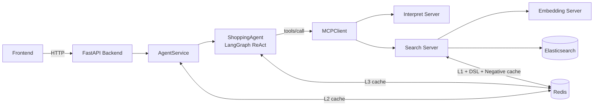
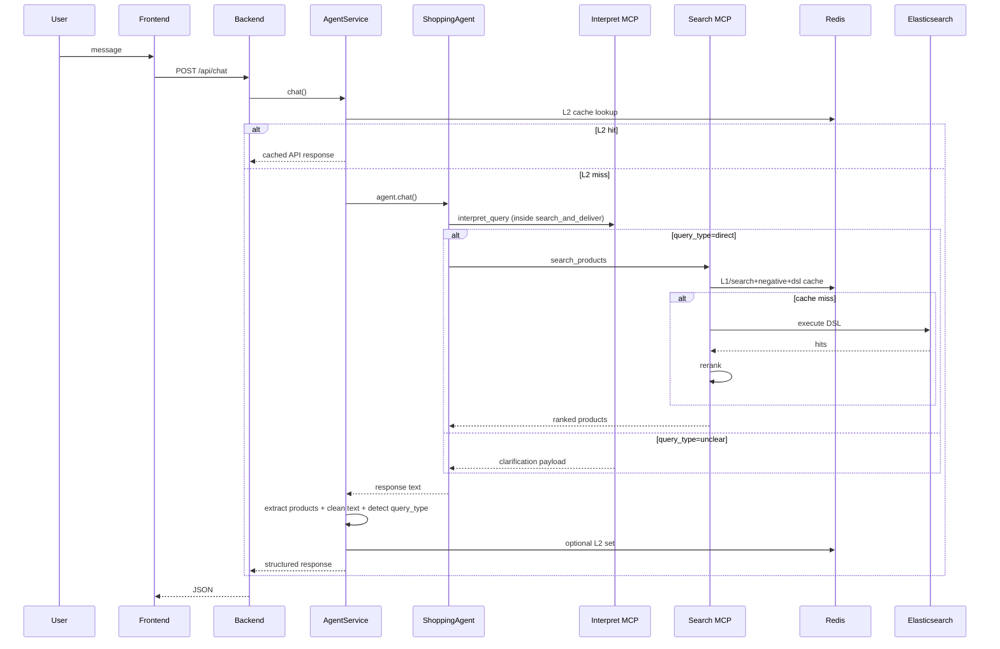

# Architecture (English)

## 1. System Context
Shopping AI Assistant V3 is an **agent-first** architecture:
- Frontend calls backend `/api/chat`
- Backend delegates to `AgentService`
- `ShoppingAgent` decides tool calls
- MCP servers execute interpret/search/embedding responsibilities
- Redis and Elasticsearch provide persistence and retrieval speed

## 2. Runtime Components

| Layer | File(s) | Responsibility |
|---|---|---|
| API Gateway | `backend/main.py`, `backend/api/routes.py` | HTTP endpoints, lifespan, health check, CORS |
| Service Wrapper | `backend/services/agent_service.py` | Agent init, timeout handling, L2 response cache, response normalization |
| Agent | `src/agent.py` | LangGraph ReAct, tool orchestration, prompt policy, L3 formatted-response cache |
| MCP Transport | `src/mcp_client.py` | Session-aware MCP `tools/call`, retries, SSE/JSON parsing |
| Interpret MCP | `src/mcp_servers/interpret_server.py` | Query classification (`direct` / `unclear`) + extraction |
| Search MCP | `src/mcp_servers/search_server.py` | DSL generation, ES search, rerank, category guard, caching |
| Embedding MCP | `src/mcp_servers/embedding_server.py` | Embedding generation/similarity with in-memory cache |
| Telemetry | `src/pipeline_logger.py` | Trace context, structured stage logs, `LATENCY_SUMMARY` events |

## 3. Decision Topology (Current)
The routing decision for product search is made by the **agent model** (prompt-driven), not by external deterministic router code.

- Agent modes in prompt: chat / clarify / search / details
- Tool path for product retrieval:
  - `search_and_deliver(query)` (return-direct tool)
  - internally calls `interpret_query` then `search_products`
- Interpret server currently coerces outcomes to:
  - `direct`
  - `unclear`

## 4. Data and Control Flow

## 5. Caching Architecture

| Cache Layer | Location | Key Pattern | What is cached |
|---|---|---|---|
| L1 Search | `search_server` (Redis) | `cache:v2:search:*` | Ranked search results |
| Negative Search | `search_server` (Redis) | `cache:v2:negative:*` | Known no-result query+intent pairs |
| DSL Cache | `search_server` (Redis) | `cache:v1:dsl:*` | Generated DSL JSON |
| L2 Agent Response | `AgentService` (Redis) | `cache:v1:agent:*` | Full API response payload |
| L3 LLM Text | `src/agent.py` (Redis) | `cache:v1:llm_response:*` | Final formatted model answer text |
| Interpret Embedding | `interpret_server` (Redis) | `cache:v1:embedding:*` | Query embedding vectors for category matching |
| Embedding Service Cache | `embedding_server` (in-memory) | internal hash key | Embeddings inside embedding process memory |

## 6. Search Quality Guards
Implemented in `search_server`:
- category normalization against known category map
- prune DSL category filters if not in allowed categories
- zero-hit retry without categories (single recovery attempt)
- relevancy-aware rerank that penalizes late-position query matches

## 7. Session and Memory Semantics
- Agent conversation memory: `MemorySaver` in `ShoppingAgent`
- `thread_id` is mapped to API `session_id`
- If invalid tool history error occurs, agent retries with new session id

## 8. Reliability Model
- MCP client retries initialization and transient transport/session issues
- OpenRouter mode can fallback to Groq when tool-use endpoint is unavailable
- API always returns safe response envelope; hard failures are converted to `success=false` with metadata error fields

## 9. Observability Model
- Standard service logs via `src/logging_config.py`
- Pipeline logs via `src/pipeline_logger.py`
- `LATENCY_SUMMARY` is emitted per major component (`agent.chat`, `agent_service.chat`, `interpret.pipeline`, `search.pipeline`, `mcp_client.call_tool`, ...)
- Non-debug mode still keeps:
  - user-request events
  - latency summaries
  - errors
