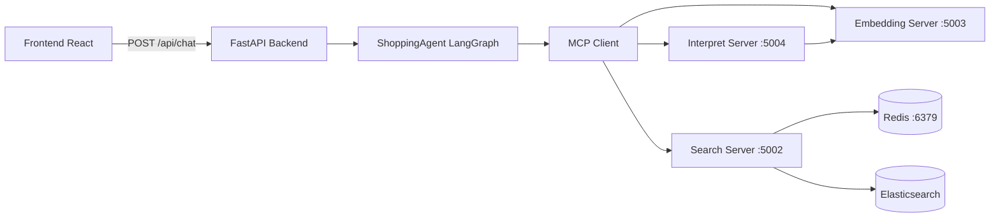
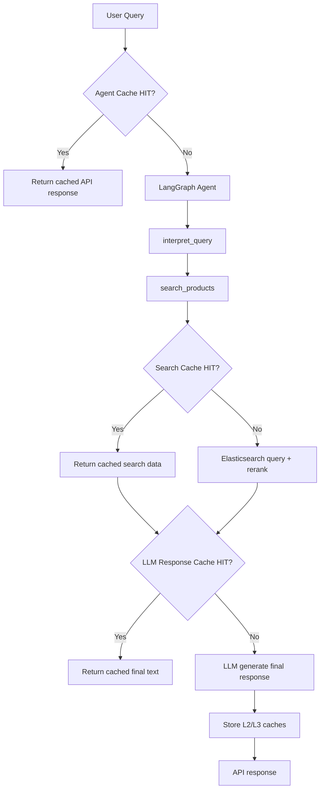

# Architecture (English)

## 1. System Overview
Shopping AI Assistant V3 is a multi-service architecture:
- FastAPI gateway for frontend/API traffic
- LangGraph agent orchestration
- MCP servers for interpret/search/embedding responsibilities
- Redis for caching
- Elasticsearch for product retrieval

## 2. Runtime Components
### 2.1 Backend (`backend/`)
- `backend/main.py`: app bootstrap, logging, lifespan
- `backend/api/routes.py`: `/api/chat`, `/api/health`
- `backend/services/agent_service.py`: response shaping + extraction + L2 cache orchestration

### 2.2 Agent (`src/agent.py`)
- Provider-selectable model (`AGENT_MODEL_PROVIDER`, `AGENT_MODEL`, `AGENT_SECOND_MODEL`)
- LangGraph ReAct workflow
- Tool calls:
  - `interpret_query`
  - `search_products`
  - `get_product_details`
- L3 cache for full LLM-formatted responses keyed by search params

### 2.3 MCP Layer
- `src/mcp_client.py`: JSON-RPC over MCP streamable-http transport
- `src/mcp_servers/interpret_server.py`: classify/extract query intent and parameters
- `src/mcp_servers/search_server.py`: DSL generation, ES query, reranking, Redis-backed cache
- `src/mcp_servers/embedding_server.py`: embedding generation and similarity tools

### 2.4 Logging
- Service logs: `src/logging_config.py`
- Pipeline logs: `src/pipeline_logger.py`
- Per-service pipeline files via `PIPELINE_SERVICE_NAME`
- Debug detail controlled by `DEBUG_LOG`

## 3. Caching Strategy
Three effective cache layers:
- L1: Search cache inside search server (Redis, query-key based)
- L2: Agent response cache in `AgentService` (`src/agent_cache.py`)
- L3: LLM formatted response cache inside `src/agent.py`

## 4. Configuration Domains
Key env categories:
- Model selection: `AGENT_MODEL_PROVIDER`, `AGENT_MODEL`, `AGENT_SECOND_MODEL`, provider-specific model keys
- Service URLs: `MCP_INTERPRET_URL`, `MCP_SEARCH_URL`, `MCP_EMBEDDING_URL`
- Data stores: `REDIS_*`, `ELASTICSEARCH_*`
- Logging/observability: `DEBUG_LOG`, `PIPELINE_*`, `USE_LOGFIRE`

## 5. Deployment Topology
### 5.1 Production
`docker-compose.yml` runs all services with:
- health checks
- json-file rotation (`max-size`, `max-file`)
- mounted `logs/` for pipeline files

### 5.2 Development
`docker-compose.dev.yml` overrides for:
- hot reload
- debug mode (`DEBUG_MODE=true`, `DEBUG_LOG=true`)
- mounted source directories

## 6. Failure Handling Notes
- MCP client retries initialization and session-expired 404 cases
- Agent service handles timeout and exception fallbacks
- Non-debug pipeline mode limits log volume to errors + user requests

## 7. Removed Legacy Pieces
Legacy cache server path (`:5007`) is no longer in active runtime flow.
Search server directly uses Redis for cache operations.
