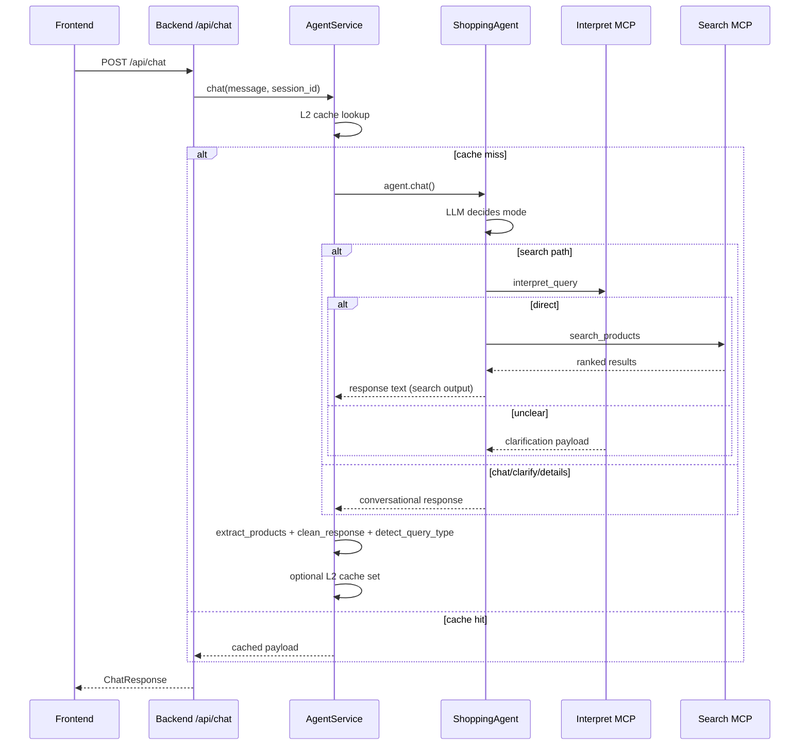
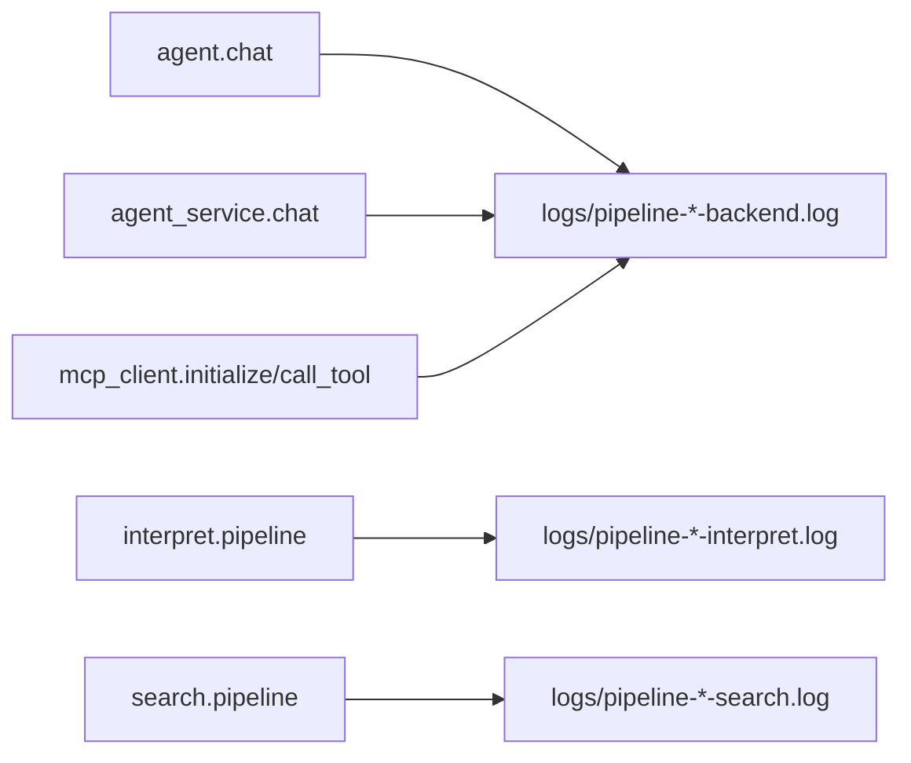

# Pipelines (English)

This document details runtime pipelines and where latency/accuracy risks usually appear.

## 1. Primary Chat Pipeline



## 2. `search_and_deliver` Internal Pipeline
This is the core tool path in `src/agent.py`.

```mermaid
flowchart TD
  A[search_and_deliver(query)] --> B[Loop guard: MAX_SEARCH_TOOL_CALLS_PER_TURN]
  B --> C[interpret_query]
  C --> D{query_type direct? searchable?}
  D -->|No| E[Return NEED_CLARIFICATION]
  D -->|Yes| F[build final_search_params]
  F --> G[L3 cache lookup]
  G -->|Hit| H[Return CACHED_RESPONSE]
  G -->|Miss| I[search_products]
  I --> J{results empty?}
  J -->|Yes| K[Return clarification with alternatives]
  J -->|No| L[Format products as JSON block]
  L --> M[Return SEARCH_RESULTS]
```

## 3. Interpret Pipeline (`interpret_server`)
1. Normalize Persian text
2. Single LLM call for classification + extraction
3. Coerce result to strict `direct | unclear`
4. If `direct`:
   - build `search_params`
   - category matching via embedding similarity
5. If non-direct:
   - return clarification object with suggestions

### Contract Shape
- `query_type`: `direct | unclear`
- `searchable`: `true | false`
- `search_params` for direct
- `clarification` for unclear

## 4. Search Pipeline (`search_server`)
1. Sanitize incoming categories
2. Negative-cache check
3. Search-cache lookup (+ lock to reduce stampede)
4. DSL generation:
   - primary: Mixtral DSL generator via OpenRouter
   - fallback: rule-based DSL
   - optional KNN embedding injection
5. Execute Elasticsearch query
6. Optional category-guard retry when first query returns zero hits
7. Rerank results by value + relevancy
8. Cache successful results

## 5. Rerank Pipeline
Rerank combines:
- ES score
- lexical relevancy position score
- brand score
- normalized price utility
- discount effect

Intent-dependent ordering:
- `find_cheapest`: relevancy first, then lower price
- `find_high_quality`: relevancy + brand/score priority
- default: descending `value_score`

## 6. Frontend Rendering Pipeline
1. Receive backend `ChatResponse`
2. Read `response` + `products`
3. If products missing, parse JSON-like block from `response`
4. Strip JSON block from display text
5. Render message and product cards/list

## 7. Latency Telemetry Pipeline
Every major stage emits `LATENCY_SUMMARY`.



## 8. Common Bottleneck Locations
- `mcp_client.initialize`: first-call session init overhead
- `interpret.pipeline.llm_classification_ms`: LLM classification latency
- `mcp_client.call_tool` to interpret/search: network + server latency
- `search.pipeline.es_search_ms`: ES query latency

## 9. Practical Validation Commands
```bash
# full latency summaries
grep -h "LATENCY_SUMMARY" logs/pipeline-*.log

# ranked bottlenecks
python3 scripts/analyze_latency_logs.py --log-dir logs --top 30

# component-level focus
python3 scripts/analyze_latency_logs.py --log-dir logs --component agent.chat
python3 scripts/analyze_latency_logs.py --log-dir logs --component interpret.pipeline
python3 scripts/analyze_latency_logs.py --log-dir logs --component search.pipeline
```
