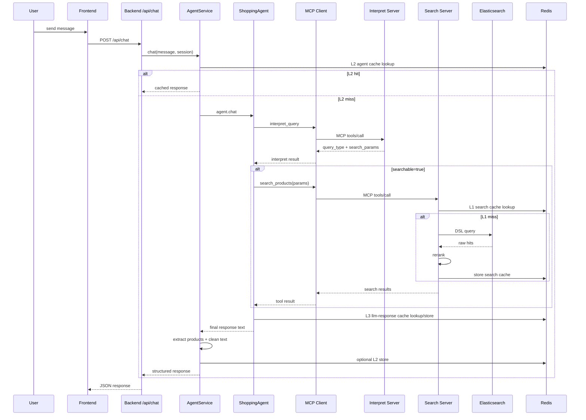
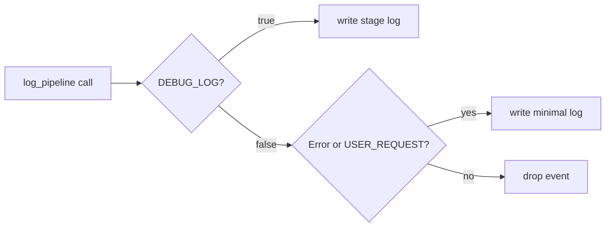

# Pipelines (English)

## 1. End-to-End Chat Pipeline

## 2. Interpret Pipeline
1. Normalize Persian input.
2. Classify and extract via LLM.
3. Build response contract:
   - `searchable`
   - `query_type`
   - `search_params` (product, brand, intent, price_range, categories)
4. For non-searchable requests, return clarification suggestions.

## 3. Search Pipeline
1. Receive structured params from agent.
2. Build cache keys.
3. Check negative cache.
4. Check search cache.
5. If miss:
   - generate DSL
   - execute Elasticsearch query
   - rerank with intent-aware logic
   - set caches
6. Return canonical result payload.

## 4. Embedding Pipeline
1. Receive text or list of texts.
2. Normalize/prepend E5 query prefix when needed.
3. Compute vectors with sentence-transformers.
4. Optional in-memory cache hit path.
5. Return embedding + metadata.

## 5. Logging Pipeline
Debug mode (`DEBUG_LOG=true`):
- full per-stage logs
- start/end stage timings
- query summaries

Non-debug mode (`DEBUG_LOG=false`):
- only `USER_REQUEST` events
- all errors

## 6. Frontend Rendering Pipeline
1. Receive backend response (`response`, `products`).
2. Normalize products.
3. If `products` empty, parse JSON-like payload from `response`.
4. Strip JSON code block from displayed message.
5. Render:
   - single product card-like row
   - or multi-row product table

## 7. Performance Controls
- Rotating pipeline log files (`PIPELINE_LOG_MAX_BYTES`, `PIPELINE_LOG_BACKUP_COUNT`)
- Docker log rotation in compose
- Debug/off modes for cache bypass and log granularity
