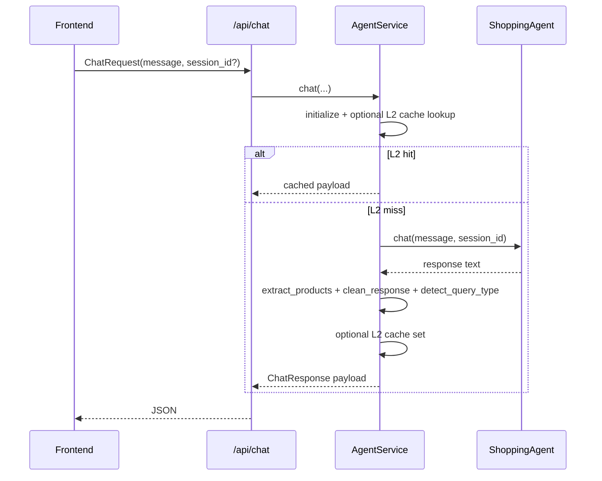
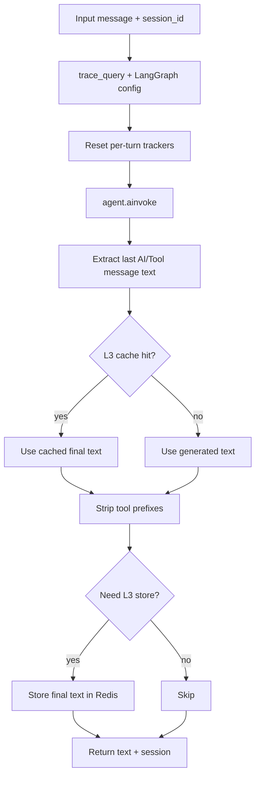
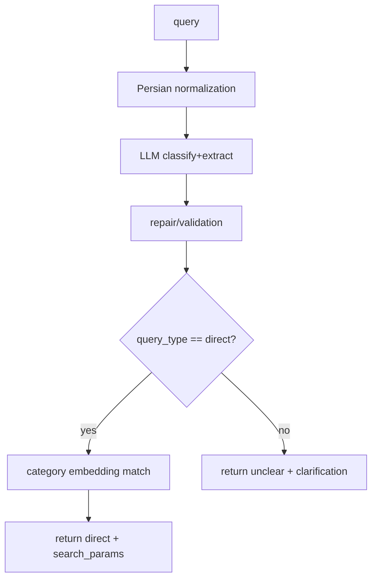
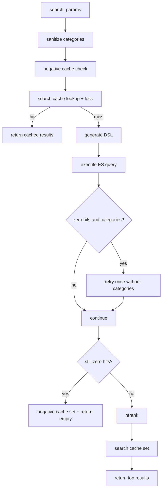
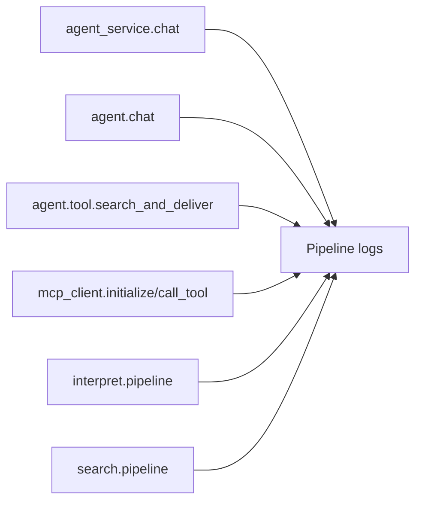

# Pipelines (English)

This document describes execution pipelines exactly as implemented in code.

## 1. API Chat Pipeline



Main implementation:
- `backend/api/routes.py`
- `backend/services/agent_service.py`

## 2. Agent Turn Pipeline (`ShoppingAgent.chat`)



Error/fallback branches:
- Tool-use endpoint unavailable (`404` tool-use) -> fallback agent on Groq if configured.
- Invalid tool call history -> retry with new `session_id`.
- Other failures -> return `__AGENT_ERROR__:{...}` envelope.

Main implementation:
- `src/agent.py`

## 3. Tool Pipeline: `search_and_deliver`

```mermaid
flowchart TD
  T0[search_and_deliver(query)] --> T1[Loop guard]
  T1 --> T2[interpret_query via MCP]
  T2 --> T3{direct and searchable?}
  T3 -->|no| T4[Build NEED_CLARIFICATION response]
  T3 -->|yes| T5[Build final_search_params]
  T5 --> T6[L3 cache lookup by search params]
  T6 -->|hit| T7[Return CACHED_RESPONSE prefix]
  T6 -->|miss| T8[search_products via MCP]
  T8 --> T9{results empty?}
  T9 -->|yes| T10[Return NEED_CLARIFICATION with alternatives]
  T9 -->|no| T11[Format product JSON block]
  T11 --> T12[Return SEARCH_RESULTS prefix]
```

Notes:
- This tool is declared `@tool(return_direct=True)`.
- Prefixes are later cleaned by `AgentService`.

Main implementation:
- `src/agent.py`

## 4. Interpret Pipeline



Current hard behavior:
- Any non-direct signal is coerced to `unclear`.
- Classification contract keys:
  - `query_type`, `product`, `brand`, `price_range`, `intent`, `confidence`

Main implementation:
- `src/mcp_servers/interpret_server.py`

## 5. Search Pipeline



DSL generation strategy:
1. Mixtral via OpenRouter (`MIXTRAL_MODEL`)
2. Rule-based fallback DSL
3. Optional KNN append/injection using embedding MCP

Main implementation:
- `src/mcp_servers/search_server.py`

## 6. Latency Instrumentation Pipeline

Every major stage writes `LATENCY_SUMMARY` for analysis.



Tools:
- `grep -h "LATENCY_SUMMARY" logs/pipeline-*.log`
- `python3 scripts/analyze_latency_logs.py --log-dir logs --top 30`

## 7. Common Bottleneck Positions
- `mcp_client.initialize`: first call per service/session mode.
- `interpret.pipeline.llm_classification_ms`: interpret LLM latency.
- `mcp_client.call_tool.http_request_ms`: transport/server overhead.
- `search.pipeline.es_search_ms`: Elasticsearch latency.
- `search.pipeline.rerank_ms`: heavy result lists + scoring.

## 8. Accuracy-Sensitive Pipeline Points
- Agent mode selection in system prompt.
- Interpret direct/unclear classification quality.
- Category match quality in interpret (`_match_categories`).
- DSL category filter quality and pruning in search.
- Rerank scoring weights and intent sort behavior.
