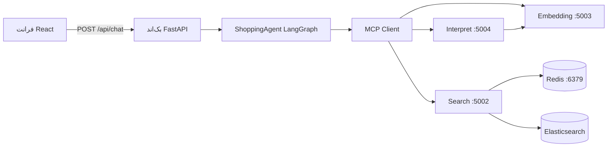
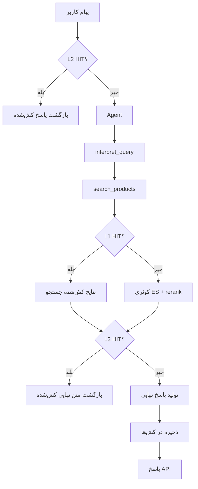

# معماری سیستم (فارسی)

## ۱) نمای کلی
نسخه سوم دستیار خرید از چند سرویس مستقل تشکیل شده است:
- `backend` برای API و اتصال فرانت
- `agent` برای ارکستریشن جریان گفتگو
- سرورهای MCP برای تفسیر، جستجو و امبدینگ
- Redis برای کش
- Elasticsearch برای بازیابی محصولات

## ۲) اجزای اصلی
### ۲.۱ بک‌اند (`backend/`)
- `backend/main.py`: راه‌اندازی اپ، logging، lifespan
- `backend/api/routes.py`: مسیرهای `/api/chat` و `/api/health`
- `backend/services/agent_service.py`: ساخت پاسخ نهایی، استخراج محصول، مدیریت کش سطح ۲

### ۲.۲ ایجنت (`src/agent.py`)
- انتخاب مدل از محیط (`AGENT_MODEL_PROVIDER`, `AGENT_MODEL`, `AGENT_SECOND_MODEL`)
- اجرای ReAct روی LangGraph
- ابزارها:
  - `interpret_query`
  - `search_products`
  - `get_product_details`
- کش سطح ۳ برای خروجی نهایی LLM

### ۲.۳ لایه MCP
- `src/mcp_client.py`: ارتباط JSON-RPC با MCP
- `src/mcp_servers/interpret_server.py`: تحلیل نیت و پارامترهای جستجو
- `src/mcp_servers/search_server.py`: تولید DSL، جستجو در ES، rerank، کش Redis
- `src/mcp_servers/embedding_server.py`: تولید بردار و ابزارهای شباهت

### ۲.۴ لاگینگ
- لاگ سرویس‌ها: `src/logging_config.py`
- لاگ پایپلاین: `src/pipeline_logger.py`
- فایل جدا برای هر سرویس با `PIPELINE_SERVICE_NAME`
- میزان جزئیات با `DEBUG_LOG`

## ۳) استراتژی کش
سه لایه فعال:
- سطح ۱: کش جستجو در `search_server` (Redis)
- سطح ۲: کش پاسخ ایجنت در `src/agent_cache.py`
- سطح ۳: کش خروجی نهایی LLM در `src/agent.py`

## ۴) پیکربندی
گروه متغیرهای مهم:
- مدل: `AGENT_MODEL_PROVIDER`, `AGENT_MODEL`, `AGENT_SECOND_MODEL`
- آدرس سرویس‌ها: `MCP_INTERPRET_URL`, `MCP_SEARCH_URL`, `MCP_EMBEDDING_URL`
- دیتااستورها: `REDIS_*`, `ELASTICSEARCH_*`
- لاگ و مانیتورینگ: `DEBUG_LOG`, `PIPELINE_*`, `USE_LOGFIRE`

## ۵) توپولوژی اجرا
### Production
در `docker-compose.yml`:
- healthcheck
- چرخش لاگ docker
- mount پوشه `logs/`

### Development
در `docker-compose.dev.yml`:
- hot-reload
- `DEBUG_MODE=true`
- `DEBUG_LOG=true`

## ۶) خطا و مقاومت
- MCP client برای init و انقضای session retry دارد
- AgentService مسیر timeout/error fallback دارد
- در حالت non-debug فقط درخواست کاربر + خطا ثبت می‌شود

## ۷) بخش‌های قدیمی حذف‌شده
مسیر cache server قدیمی (`:5007`) در مسیر اصلی اجرا استفاده نمی‌شود.
الان search server مستقیم با Redis کار می‌کند.
