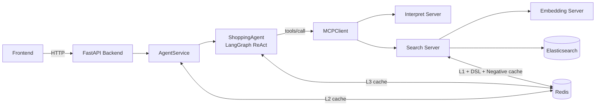
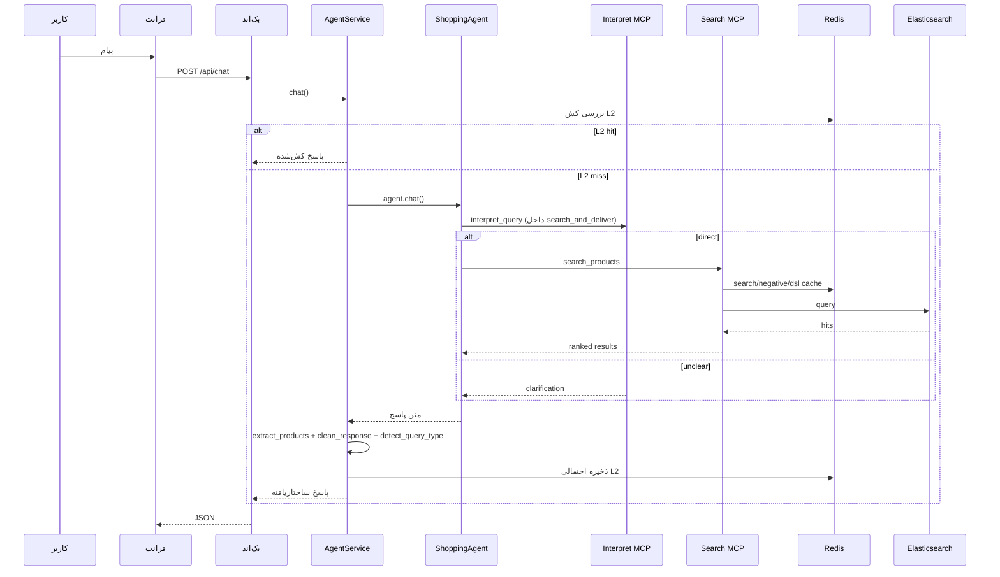

# معماری سیستم (فارسی)

## ۱) نمای کلی سیستم
معماری پروژه **agent-first** است:
- فرانت پیام کاربر را به بک‌اند می‌فرستد
- `AgentService` مدیریت سشن/کش/ساخت پاسخ API را انجام می‌دهد
- `ShoppingAgent` تصمیم می‌گیرد ابزار صدا زده شود یا خیر
- سرورهای MCP وظایف interpret/search/embedding را اجرا می‌کنند
- Redis و Elasticsearch لایه‌های داده و کارایی هستند

## ۲) اجزای Runtime

| لایه | فایل(ها) | مسئولیت |
|---|---|---|
| درگاه API | `backend/main.py`, `backend/api/routes.py` | endpointها، lifespan، health check، CORS |
| سرویس واسط | `backend/services/agent_service.py` | init ایجنت، timeout، کش سطح ۲، نرمال‌سازی پاسخ |
| ایجنت | `src/agent.py` | ReAct، ابزارها، پرامپت، کش سطح ۳ |
| ترنسپورت MCP | `src/mcp_client.py` | `initialize` + `tools/call` با مدیریت سشن و retry |
| Interpret MCP | `src/mcp_servers/interpret_server.py` | طبقه‌بندی کوئری (`direct/unclear`) + استخراج پارامتر |
| Search MCP | `src/mcp_servers/search_server.py` | تولید DSL، جستجو ES، rerank، category guard، کش |
| Embedding MCP | `src/mcp_servers/embedding_server.py` | embedding و similarity |
| تلماتری | `src/pipeline_logger.py` | trace context، لاگ مرحله‌ای، `LATENCY_SUMMARY` |

## ۳) توپولوژی تصمیم‌گیری
در مسیر فعلی، تصمیم روتینگ گفتگو/جستجو توسط **مدل ایجنت** انجام می‌شود (prompt-driven).

- مودهای پرامپت: chat / clarify / search / details
- مسیر جستجو از ابزار `search_and_deliver` انجام می‌شود
- interpret در معماری فعلی خروجی را به `direct | unclear` محدود می‌کند

## ۴) جریان داده و کنترل

## ۵) معماری کش

| لایه کش | محل | الگوی کلید | داده کش‌شده |
|---|---|---|---|
| L1 Search | `search_server` (Redis) | `cache:v2:search:*` | خروجی رنک‌شده جستجو |
| Negative Cache | `search_server` (Redis) | `cache:v2:negative:*` | کوئری‌هایی که نتیجه ندارند |
| DSL Cache | `search_server` (Redis) | `cache:v1:dsl:*` | DSL تولیدشده |
| L2 Agent Cache | `AgentService` (Redis) | `cache:v1:agent:*` | پاسخ کامل API |
| L3 LLM Cache | `src/agent.py` (Redis) | `cache:v1:llm_response:*` | متن نهایی فرمت‌شده LLM |
| Interpret Embedding Cache | `interpret_server` (Redis) | `cache:v1:embedding:*` | embedding کوئری برای category match |
| Embedding Service Cache | `embedding_server` (memory) | کلید داخلی | embedding داخل همان پروسس |

## ۶) گاردهای کیفیت در Search
- نرمال‌سازی دسته‌ها با لیست دسته‌های معتبر
- حذف فیلتر دسته نامعتبر از DSL در کد (نه فقط پرامپت)
- یک retry بدون category وقتی اولین جستجو صفر نتیجه باشد
- rerank با امتیاز relevancy برای کاهش نتایج بی‌ربط

## ۷) سشن و حافظه گفتگو
- حافظه گفتگو با `MemorySaver` در `ShoppingAgent`
- `session_id` API به `thread_id` ایجنت نگاشت می‌شود
- در خطای history/tool mismatch، ایجنت با سشن جدید retry می‌کند

## ۸) پایداری و خطا
- `MCPClient` برای init و خطاهای transport/session retry دارد
- در حالت OpenRouter، fallback به Groq قابل فعال‌سازی است
- API در خطا خروجی امن و ساختاریافته با `success=false` می‌دهد

## ۹) مانیتورینگ و لاگ
- لاگ سرویس‌ها: `src/logging_config.py`
- لاگ پایپلاین: `src/pipeline_logger.py`
- رویدادهای `LATENCY_SUMMARY` برای اجزای اصلی مثل:
  - `agent.chat`
  - `agent_service.chat`
  - `interpret.pipeline`
  - `search.pipeline`
  - `mcp_client.call_tool`
