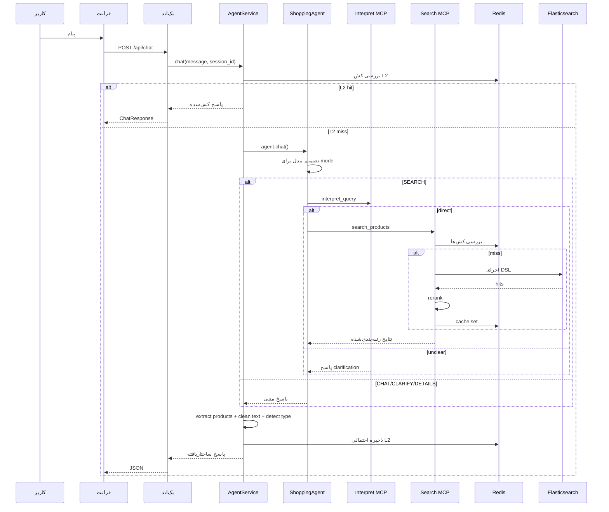

# معماری سیستم (فارسی)

## ۱) دامنه و سبک معماری
این پروژه یک معماری **Agent-First با Tool-Calling** دارد.

ویژگی‌های اصلی:
- یک درگاه HTTP واحد با FastAPI
- تصمیم‌گیری هر نوبت مکالمه توسط مدل ایجنت
- اجرای ابزارها توسط سرویس‌های MCP روی `/mcp`
- جستجوی محصول روی Elasticsearch با چند لایه کش
- ثبت لاگ ساختاریافته برای تحلیل تاخیر

## ۲) توپولوژی کلان

## ۳) مسئولیت اجزا

| جزء | فایل‌های اصلی | مسئولیت |
|---|---|---|
| API Gateway | `backend/main.py`, `backend/api/routes.py` | endpointها، lifecycle، health، CORS |
| Service Layer | `backend/services/agent_service.py` | init ایجنت، timeout، کش L2، نرمال‌سازی پاسخ |
| Agent | `src/agent.py` | تصمیم‌گیری prompt-driven، tool-calling، حافظه، کش L3 |
| MCP Client | `src/mcp_client.py` | initialize/retry/session + parse JSON/SSE |
| Interpret MCP | `src/mcp_servers/interpret_server.py` | تشخیص `direct/unclear` + استخراج پارامتر |
| Search MCP | `src/mcp_servers/search_server.py` | تولید DSL، جستجو ES، rerank، گارد category، کش |
| Embedding MCP | `src/mcp_servers/embedding_server.py` | embedding/similarity + کش درون‌پردازه |
| Telemetry | `src/pipeline_logger.py` | trace id، لاگ مرحله‌ای، `LATENCY_SUMMARY` |

## ۴) جریان کنترل End-to-End

## ۵) مدل تصمیم ایجنت
ایجنت دو ابزار دارد:
- `search_and_deliver(query)`
- `get_product_details(product_id)`

modeهای پرامپت:
- `CHAT`
- `CLARIFY`
- `SEARCH`
- `DETAILS`

اما خروجی نهایی Interpret فعلاً فقط:
- `direct`
- `unclear`

نتیجه:
- حتی اگر ایجنت مسیر SEARCH را انتخاب کند، Interpret می‌تواند آن را `unclear` برگرداند.

## ۶) معماری کش

namespaceهای مهم:
- `cache:v1:agent:*`
- `cache:v1:llm_response:*`
- `cache:v2:search:*`
- `cache:v2:negative:*`
- `cache:v1:dsl:*`
- `cache:v1:embedding:*`

## ۷) کنترل کیفیت نتایج در Search
در `search_server`:
- نرمال‌سازی categoryها با لیست معتبر
- حذف فیلتر category نامعتبر از DSL در کد
- یک retry بدون category در حالت صفر نتیجه
- rerank با ترکیب score/relevancy/price/brand/discount

## ۸) سشن و حافظه
- حافظه مکالمه با `MemorySaver` در LangGraph
- `session_id` API به `thread_id` نگاشت می‌شود
- اگر history ابزار خراب شود، ایجنت با سشن جدید retry می‌کند

## ۹) پایداری و fallback
- `MCPClient` برای init/transport/session retry دارد
- در OpenRouter، fallback به Groq قابل فعال‌سازی است
- Backend خطا را به پاسخ امن با `success=false` تبدیل می‌کند

## ۱۰) مدل لاگ و مانیتورینگ
`src/pipeline_logger.py` برای هر trace لاگ ساختاریافته می‌نویسد.

کامپوننت‌های کلیدی latency:
- `agent_service.chat`
- `agent.chat`
- `agent.tool.search_and_deliver`
- `mcp_client.initialize`
- `mcp_client.call_tool`
- `interpret.pipeline`
- `search.pipeline`

## ۱۱) محدودیت‌های شناخته‌شده (نسخه فعلی)
- پاسخ نهایی هنوز بعد از tool output از مسیر LLM عبور می‌کند.
- Interpret فقط `direct/unclear` را پشتیبانی می‌کند.
- نام‌گذاری intent در بخش‌هایی از Search هنوز با خروجی `find_best` کاملاً یکسان نیست (برخی شاخه‌ها legacy هستند).
