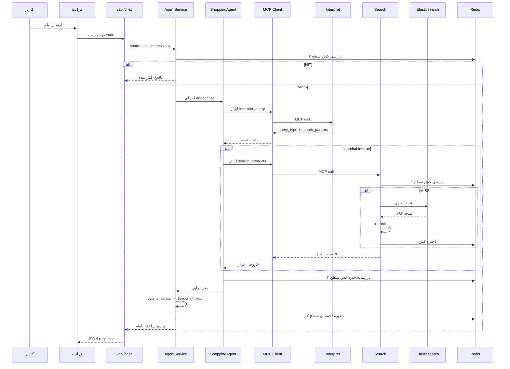
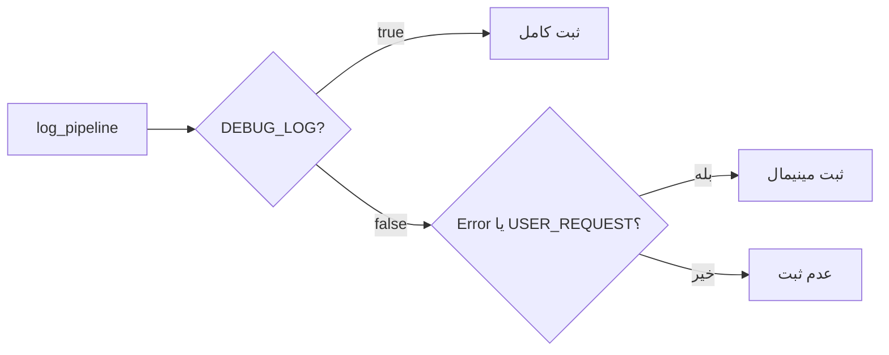

# پایپلاین‌ها (فارسی)

## ۱) پایپلاین کامل گفتگو

## ۲) پایپلاین تفسیر (Interpret)
1. نرمال‌سازی متن فارسی.
2. اجرای LLM برای تشخیص نوع کوئری و استخراج پارامترها.
3. ساخت خروجی استاندارد:
   - `searchable`
   - `query_type`
   - `search_params`
4. اگر جستجوپذیر نبود: پیشنهاد و سوال تکمیلی.

## ۳) پایپلاین جستجو (Search)
1. دریافت پارامترهای ساختاریافته.
2. ساخت کلیدهای کش.
3. بررسی negative cache.
4. بررسی search cache.
5. در صورت miss:
   - تولید DSL
   - اجرای جستجو در Elasticsearch
   - rerank
   - ذخیره کش
6. برگرداندن خروجی استاندارد.

## ۴) پایپلاین امبدینگ (Embedding)
1. دریافت متن یا لیست متن.
2. پیش‌پردازش و prefix مدل E5.
3. تولید embedding با sentence-transformers.
4. استفاده اختیاری از کش داخلی در حافظه.
5. بازگشت بردار + متادیتا.

## ۵) پایپلاین لاگینگ
### حالت Debug (`DEBUG_LOG=true`)
- همه استیج‌ها با جزئیات ثبت می‌شوند
- زمان‌بندی start/end ثبت می‌شود

### حالت Non-Debug (`DEBUG_LOG=false`)
- فقط `USER_REQUEST`
- همه خطاها

## ۶) پایپلاین رندر فرانت
1. دریافت `response` و `products`.
2. نرمال‌سازی محصولات.
3. اگر `products` خالی بود، استخراج JSON از متن پاسخ.
4. حذف بلاک JSON از متن نمایشی.
5. نمایش:
   - کارت تک‌محصول
   - یا جدول چندمحصول

## ۷) کنترل کارایی و حافظه
- فایل‌های pipeline با rotation
- rotation لاگ docker در compose
- در production: `DEBUG_LOG=false`
