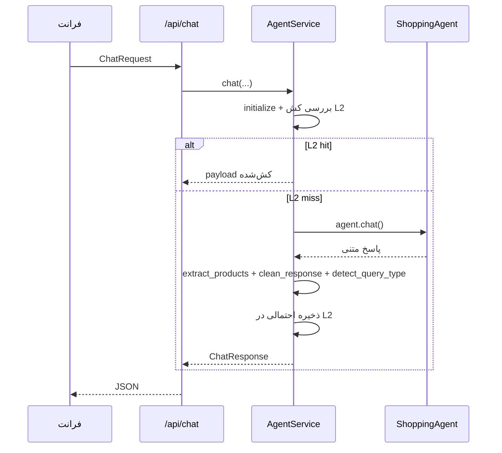
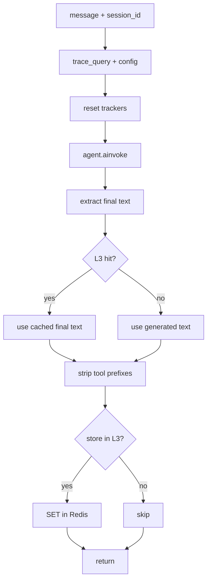
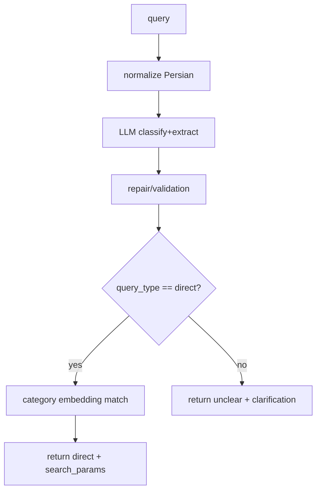
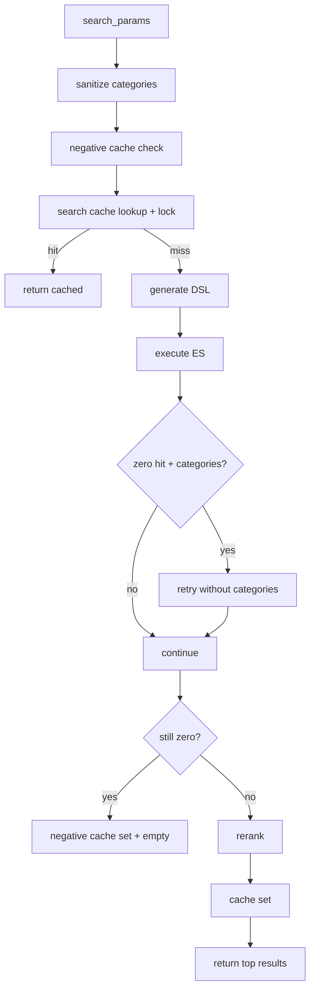
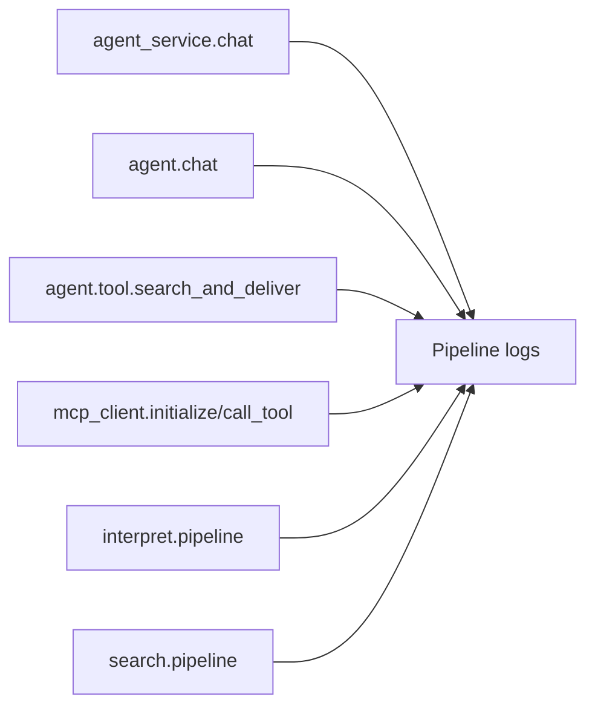

# پایپلاین‌ها (فارسی)

این سند مسیرهای اجرایی واقعی سیستم را بر اساس کد فعلی توضیح می‌دهد.

## ۱) پایپلاین API چت



فایل‌های اصلی:
- `backend/api/routes.py`
- `backend/services/agent_service.py`

## ۲) پایپلاین نوبت ایجنت (`ShoppingAgent.chat`)



شاخه‌های خطا:
- خطای نبود endpoint tool-use در مدل اصلی -> fallback به Groq (در صورت فعال بودن)
- خطای mismatch history ابزار -> retry با session جدید
- سایر خطاها -> `__AGENT_ERROR__:{...}`

فایل اصلی:
- `src/agent.py`

## ۳) پایپلاین ابزار `search_and_deliver`

```mermaid
flowchart TD
  T0[search_and_deliver(query)] --> T1[loop guard]
  T1 --> T2[interpret_query]
  T2 --> T3{direct + searchable?}
  T3 -->|خیر| T4[بازگشت NEED_CLARIFICATION]
  T3 -->|بله| T5[ساخت final_search_params]
  T5 --> T6[بررسی کش L3 بر اساس search params]
  T6 -->|hit| T7[بازگشت CACHED_RESPONSE]
  T6 -->|miss| T8[search_products]
  T8 --> T9{نتیجه خالی؟}
  T9 -->|بله| T10[clarification + پیشنهاد جایگزین]
  T9 -->|خیر| T11[فرمت JSON محصولات]
  T11 --> T12[بازگشت SEARCH_RESULTS]
```

نکته:
- این ابزار `return_direct=True` است.
- prefixها بعداً در `AgentService` پاک‌سازی می‌شوند.

فایل اصلی:
- `src/agent.py`

## ۴) پایپلاین Interpret



رفتار سخت‌گیر فعلی:
- هر خروجی غیر مستقیم به `unclear` coercion می‌شود.
- کلیدهای قرارداد: `query_type`, `product`, `brand`, `price_range`, `intent`, `confidence`

فایل اصلی:
- `src/mcp_servers/interpret_server.py`

## ۵) پایپلاین Search



استراتژی DSL:
1. تولید با Mixtral روی OpenRouter
2. fallback rule-based
3. در صورت semantic فعال، افزودن یا تزریق KNN embedding

فایل اصلی:
- `src/mcp_servers/search_server.py`

## ۶) پایپلاین ثبت تاخیر



دستورات تحلیل:
- `grep -h "LATENCY_SUMMARY" logs/pipeline-*.log`
- `python3 scripts/analyze_latency_logs.py --log-dir logs --top 30`

## ۷) نقاط رایج bottleneck
- `mcp_client.initialize` (به‌خصوص درخواست اول)
- `interpret.pipeline.llm_classification_ms`
- `mcp_client.call_tool.http_request_ms`
- `search.pipeline.es_search_ms`
- `search.pipeline.rerank_ms`

## ۸) نقاط حساس دقت
- تصمیم mode در پرامپت ایجنت
- کیفیت direct/unclear در interpret
- کیفیت category matching در interpret
- کیفیت DSL و category pruning در search
- وزن‌دهی rerank و sort وابسته به intent
