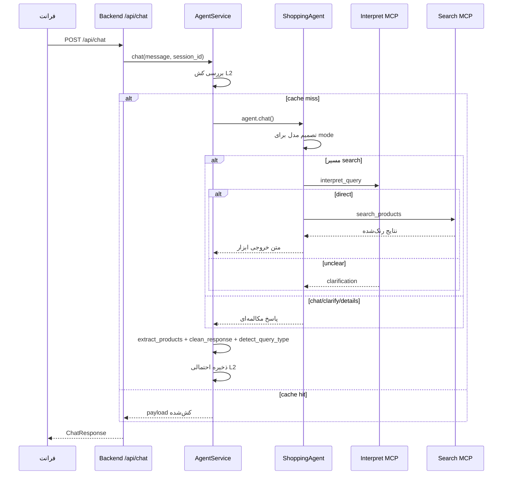
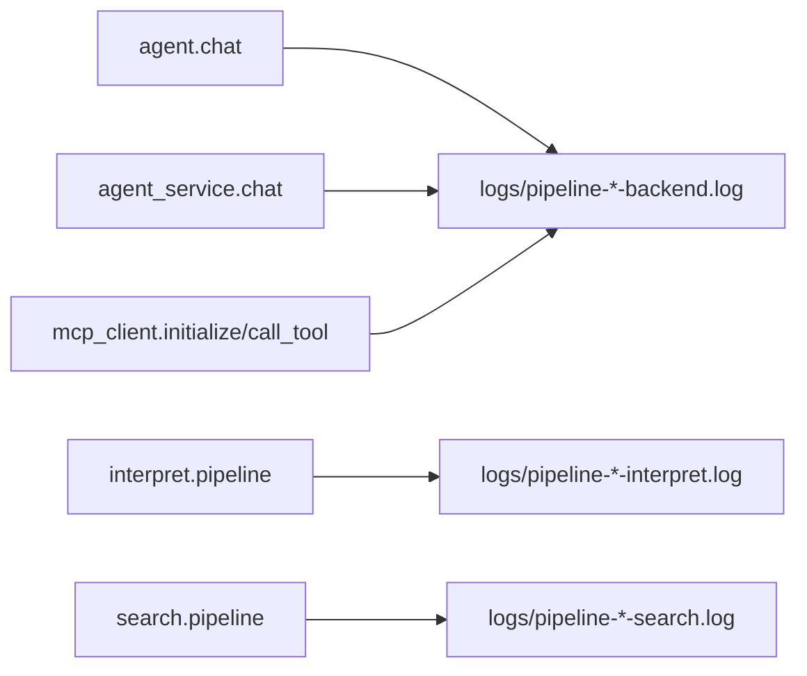

# پایپلاین‌ها (فارسی)

این سند مسیرهای اجرایی اصلی را مرحله‌به‌مرحله توضیح می‌دهد و نقاط رایج bottleneck را مشخص می‌کند.

## ۱) پایپلاین اصلی گفتگو



## ۲) پایپلاین داخلی `search_and_deliver`
ابزار اصلی جستجو در `src/agent.py`.

```mermaid
flowchart TD
  A[search_and_deliver(query)] --> B[Loop guard: MAX_SEARCH_TOOL_CALLS_PER_TURN]
  B --> C[interpret_query]
  C --> D{query_type direct? searchable?}
  D -->|خیر| E[بازگشت NEED_CLARIFICATION]
  D -->|بله| F[ساخت final_search_params]
  F --> G[بررسی کش L3]
  G -->|Hit| H[بازگشت CACHED_RESPONSE]
  G -->|Miss| I[search_products]
  I --> J{نتیجه خالی؟}
  J -->|بله| K[پیشنهاد جایگزین + clarification]
  J -->|خیر| L[فرمت JSON محصولات]
  L --> M[بازگشت SEARCH_RESULTS]
```

## ۳) پایپلاین Interpret
1. نرمال‌سازی متن فارسی
2. یک LLM call برای classification + extraction
3. کوِرس خروجی به `direct | unclear`
4. اگر `direct`:
   - ساخت `search_params`
   - category matching بر پایه embedding
5. اگر `unclear`:
   - بازگشت سوال تکمیلی + پیشنهاد

## ۴) پایپلاین Search
1. sanitize دسته‌های ورودی
2. negative-cache check
3. search-cache lookup + lock برای کاهش stampede
4. تولید DSL:
   - مسیر اول: Mixtral روی OpenRouter
   - مسیر fallback: DSL rule-based
   - تزریق KNN embedding در صورت فعال بودن semantic
5. اجرای جستجو روی Elasticsearch
6. اگر صفر نتیجه و category وجود داشت: یک بار retry بدون category
7. rerank نتایج
8. ذخیره cache

## ۵) پایپلاین Rerank
امتیاز نهایی با ترکیب:
- ES score
- relevancy موقعیت کلمه کوئری در نام محصول
- brand score
- utility قیمت
- discount

مرتب‌سازی وابسته به intent:
- `find_cheapest`: relevancy بالا + قیمت کمتر
- `find_high_quality`: relevancy + برند/score
- پیش‌فرض: `value_score` نزولی

## ۶) پایپلاین رندر فرانت
1. دریافت `ChatResponse`
2. استفاده از `response` + `products`
3. اگر `products` خالی بود، استخراج JSON-like از متن
4. حذف بلاک JSON از متن قابل‌نمایش
5. رندر پیام + لیست محصولات

## ۷) پایپلاین تلماتری تاخیر
برای هر جزء اصلی `LATENCY_SUMMARY` ثبت می‌شود.



## ۸) نقاط رایج bottleneck
- `mcp_client.initialize` در اولین درخواست
- `interpret.pipeline.llm_classification_ms`
- `mcp_client.call_tool` (شبکه + latency سرویس مقصد)
- `search.pipeline.es_search_ms`

## ۹) دستورات عملی تحلیل تاخیر
```bash
# خلاصه‌های latency
grep -h "LATENCY_SUMMARY" logs/pipeline-*.log

# گزارش رتبه‌بندی bottleneck
python3 scripts/analyze_latency_logs.py --log-dir logs --top 30

# تحلیل component خاص
python3 scripts/analyze_latency_logs.py --log-dir logs --component agent.chat
python3 scripts/analyze_latency_logs.py --log-dir logs --component interpret.pipeline
python3 scripts/analyze_latency_logs.py --log-dir logs --component search.pipeline
```
